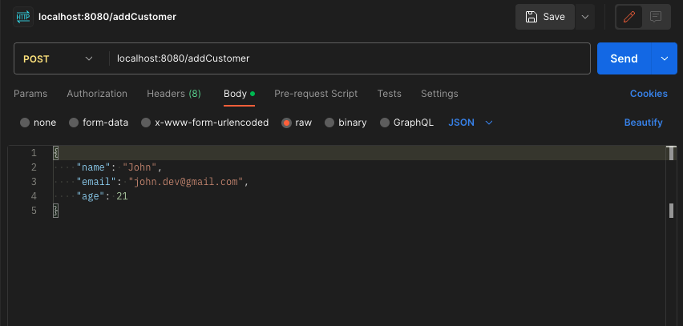
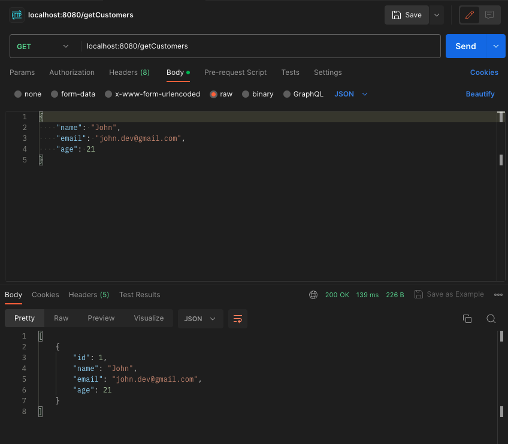
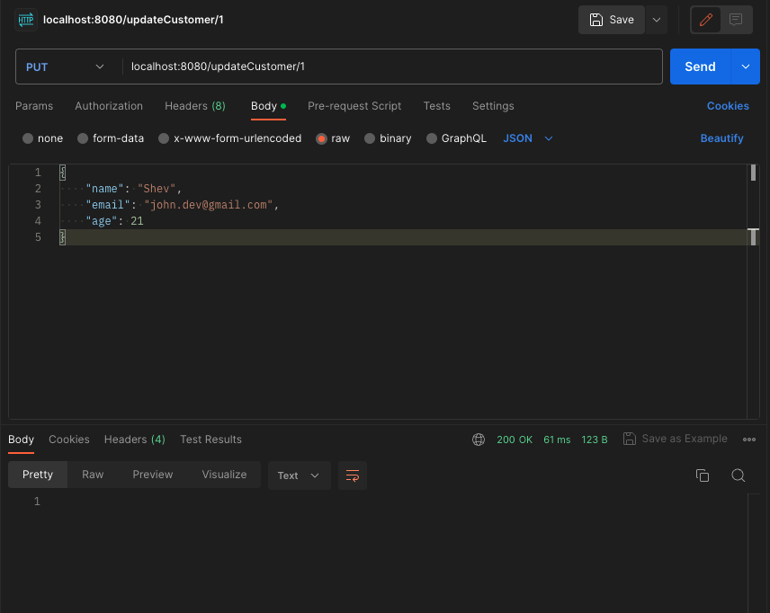
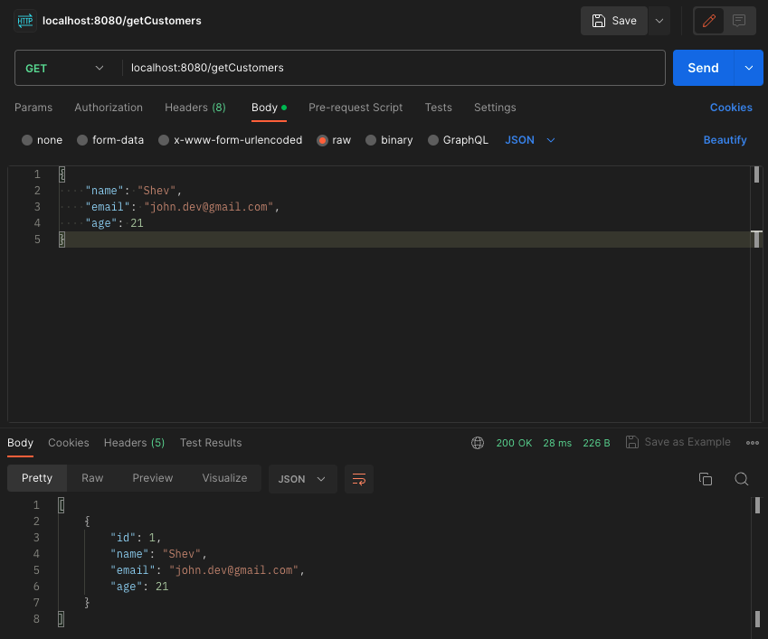
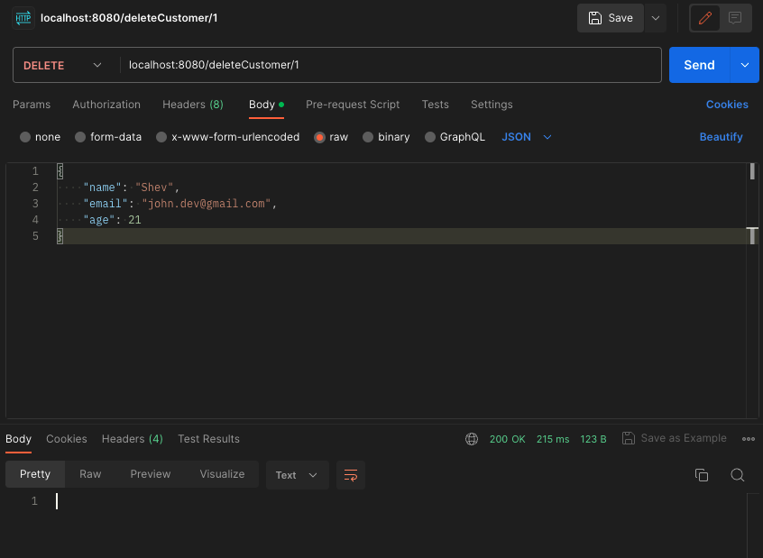
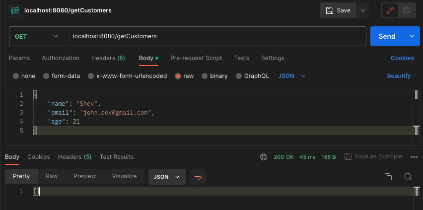

# Simple CRUD API with Spring Boot and PostgreSQL

- This project was made to learn the fundamentals of Spring Boot. It's a simple CRUD API that allows users to manage a list of customers. The project helped me understand
  1. The fundamentals of Spring Boot.
  2. Dependency injection
  3. Spring MVC and N-Tier Architecture (DOA-Business-Service layers). Layering in web applications, separating concerns into the controller, service, and repository layers.
  4. Connecting to a database hosted on Docker at a local port using Spring Data JPA.
- `notes` folder contain the notes i made while making the project and anyone keen on learning spring boot are free to use them for personal use.

## Technologies
- Languages      : Java, SQL
- Frameworks     : Spring (Spring Data), Spring Boot
- Developer Tools: Docker, PostgreSQL, Postman, IntelliJ IDEA Ultimate

## How to run the project
- Clone the repository
- Ensure you have docker running on your machine.
- Navigate to docker-compose.yml and add a user name and password for the database.
- Go to `application.yml` and change the username and password to the same values you used in the previous step.
- Run docker-compose up. This will start a PostgreSQL server running on port 5332.
- Create a database called `customer` in the PostgreSQL server. (If you already have a PostgreSQL database change the url in `application.yml` to point to that databse)
  To create a database in the PostgreSQL server, run the following commands in order in terminal in your IDE:
    `docker exec -it postgres bash`
    `psql -U your-user-name`
    `CREATE DATABASE customer;`
- Run the main application. The API is not ready to use.

## How the code is organized
- Since this is a relatively small project, I didn't use seperate packages for the layers but they are seperated by classes.
- [`project/docker-compose.yml`](https://github.com/ShevinuM/spring-boot/blob/main/project/docker-compose.yml): Defines the configuration for a Docker container running a PostgreSQL database, with the database accessible at local port 5332. The actual database, user, etc. are created by the PostgreSQL server inside the Docker container when it starts.
- [`project/src/main/java/com/shevinum`](https://github.com/ShevinuM/spring-boot/tree/main/project/src/main/java/com/shevinum): Contains the class files for all the layers of the project.
- [`project/src/main/resources/application.yml`](https://github.com/ShevinuM/spring-boot/blob/main/project/src/main/resources/application.yml): Contains the configuration for the Spring Boot application, including the database connection information.

### Layers
- API Layer: [`CustomerController.java`](https://github.com/ShevinuM/spring-boot/blob/main/project/src/main/java/com/shevinum/CustomerController.java)
- Business Layer: [`CustomerService.java`](https://github.com/ShevinuM/spring-boot/blob/main/project/src/main/java/com/shevinum/CustomerService.java)
- DAO Layer: [`CustomerRepository.java`](https://github.com/ShevinuM/spring-boot/blob/main/project/src/main/java/com/shevinum/CustomerRepository.java)
- DTO Classes: [`CustomerRequest.java`](https://github.com/ShevinuM/spring-boot/blob/main/project/src/main/java/com/shevinum/CustomerRequest.java)
- Entity Classes: [`Customer.java`](https://github.com/ShevinuM/spring-boot/blob/main/project/src/main/java/com/shevinum/Customer.java)
- Main Class: [`Main.java`](https://github.com/ShevinuM/spring-boot/blob/main/project/src/main/java/com/shevinum/Main.java)

## Features
1. Add a customer to the database.
    
2. Get a list of all customers in the database.
    
3. Update a record of a customer in the databse.
    
    
4. Delete a record of a customer in the database.
    
    

 
